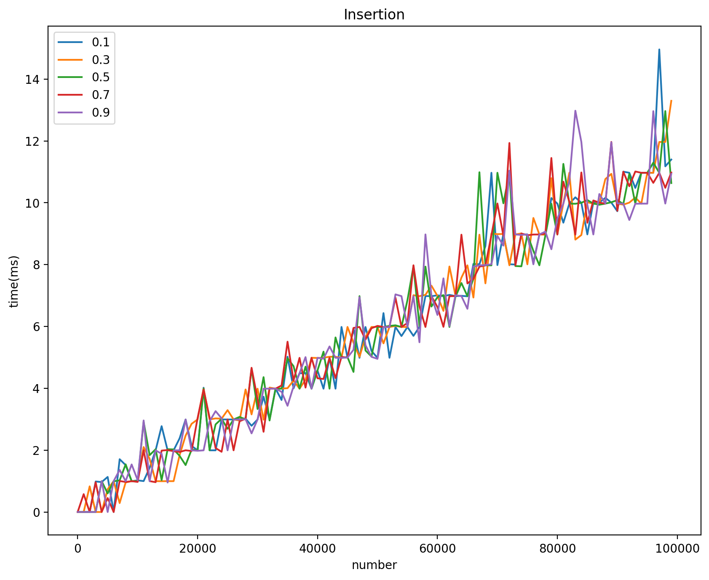

# **华东师范大学数据科学与工程学院上机实践报告**

***

课程名称：算法设计与分析      

上机实验名称：动态表 

编号：No.11

年级：21级         

日期：2022年5月13号

***

## 1.实验目的

- 本实验主要设计以下数据结构：
  - 动态表

本实验所有源码（算法源码，构图源码）已上传至个人Github：

https://github.com/Ghostlikei/Algorithm_ECNU/tree/master/Assignment11

## 2. 算法思路

- 动态表根据其**装载因子**控制内存空间的长度，超过装载因子扩容，不足某值时减容，本实验中采用的是满载时再放入就扩容，不足装载因子的一半时减容，以最大优化空间消耗和resize()函数的使用


## 3.代码分析

本次实验的动态表采用的是类似于`std::vector`的设计思维，数据结构由三部分拼装而成：迭代器(Iterator)，空间申请器(allocator)和数据结构本体(dtable)。

为了防止篇幅过长，这里只放最关键的数据结构本体，详细讨论重新分配空间的操作(resize)，源码和注释会放在报告的最后进行说明；

#### 3.1 allocator.h

简易版的`std::allocator`，函数接口如下

```cpp
class allocator{
public:
    // 默认构造函数
    allocator() = default;
    
    //空间申请，operator::new的封装
    Type* allocate(size_t size);
    
    //空间释放，operator::delete的封装
    void deallocate(Type* ptr, size_t size);
    
    //指针赋值
    void construct(Type* ptr, const Type& value);
    
    //销毁指针，释放空间
    void destory(Type* ptr);
    
    //整体数据结构的销毁，用于编写析构函数
    void _destroy(Type* firstIterator, Type* lastIterator);
};
```


#### 3.2 DTable.h

- 会尽量写清楚注释内容

```cpp
class DTable{
public:
    //别名，防止指针，引用和迭代器的类型问题，让后面的代码更加清楚
    typedef allocator<Type> _Alloc;
    typedef Type* pointer;
    typedef Type* Iterator;
    typedef Type& reference;

protected:
    // 底层的allocator，同时仿照vector，定义三个迭代器
    _Alloc _malloc;
    Iterator start;// 指向表的初始位置
    Iterator finish;// 指向表最后一个数据的位置
    Iterator endOfCapacity;// 指向内存的最后位置

private:
    float _loadFactor;// 装载因子
    void resize(const size_t& newSize);// 重新分配空间的函数

public:       
    Iterator begin() { return start; }// 函数封装初始位置，这种方法是典型的oop设计思维
    Iterator end() { return finish; }// 函数封装数据末尾
    
    //底层用迭代器的好处是下面的方法全部用迭代器实现，更加安全
    size_t size()  { return size_t(end() - begin()); }
    size_t capacity()  { return size_t( endOfCapacity - begin()); }
    bool empty() const { return begin() == end(); }
    reference operator[](size_t index){ return *(begin() + index); }
    reference front(){ return *begin(); }
    reference back(){ return *(end() - 1); }

    //构造和析构函数
    DTable();
    ~DTable();
    
    //修改装载因子
    void setFactor(float fact);
    //插入和弹出
    void push_back(const Type& value);
    void pop_back();

};
```


- 我们来看几个比较关键的函数
- `resize()`，`DTable()`,`~DTable()`,`push_back()`,`pop_back()`

```cpp
template<typename Type>
void DTable<Type>::resize(const size_t& newSize){
    size_t tempSize = size();//先存一下当前大小
    Iterator tempPtr = _malloc.allocate(newSize);// 用allocator开辟一块新的，没有赋值的空间，记作临时迭代器
    for(int i = 0; i < tempSize; i++){;
        _malloc.construct(tempPtr + i, start[i]);// 把原先的数据copy到临时的迭代器上       
    }

    for(int i = 0; i < tempSize; i++){
        _malloc.destory(start + i);// 释放原数据空间
    }
    _malloc.deallocate(start, newSize);// 销毁原迭代器
    
    start = tempPtr;// 把临时迭代器赋值到初始位置上，并且重新初始化底层的三个迭代器
    finish = start + tempSize;
    endOfCapacity = start + newSize;
}

template<typename Type>
DTable<Type>::DTable(){
    const size_t default_size = 8;// 初始大小为8，方便扩容，防止过小
    _loadFactor = 0.5;// 默认因子是0.5
    Iterator _table = _malloc.allocate(default_size);// 初始化申请空间
    
    // 三个底层迭代器的初始化
    start = _table;
    finish = start;
    endOfCapacity = start + default_size;    
}

template<typename Type>
DTable<Type>::~DTable(){
    _malloc._destroy(start, finish); // 内存释放
}

template<typename Type>
void DTable<Type>::push_back(const Type& value){
    if(size() >= capacity()){
        size_t newSize = capacity()*2;// 如果满载了就扩大一倍
        resize(newSize);
    } 
    _malloc.construct(start + size(), value);// 用allocator进行迭代器赋值
    finish++;//尾迭代器往后移
}

template<typename Type>
void DTable<Type>::pop_back(){
    if(capacity() >= 8 && size() < capacity()*_loadFactor*0.5){
        size_t newSize = capacity()/2;// 防止空间过小，大小最小为8，不足装载因子的一半减容
        resize(newSize);
    }
    _malloc.destory(start + size());// 用allocator释放最后一个数据
    finish--;//尾迭代器往前移
}
```

- 这样就实现了一个可以调节装载因子的，简陋版的vector，所有能用的方法和vector一模一样

#### 3.3 Sample.cpp

一个二维数组的演示，可以看做是vector

```cpp
    DTable<DTable<int>> tables;
    for(int i = 0; i < 5; i++){
        DTable<int> t;
        t.setFactor(0.1);
        for(int j = 0; j < 8; j++){
            t.push_back(j);
        }
        t.pop_back();
        tables.push_back(t);
    }

    for(int i = 0; i < tables.size(); i ++){
        for(int j = 0 ; j < tables[1].size(); j++){
            cout<<tables[i][j]<<endl;
        }
    }

```


## 4.算法测试

#### 4.1 时间测试

- 首先是全插入和全弹出的测试

  


- 可以看到不管是插入还是弹出，在这种设计模式下时间开销和装载因子无关，永远都是O(1)，去讨论动态表的时间消耗其实没有太大的意义，除非是这个点刚好需要resize，那还有一点讨论的价值，不过这一部分书上已经有了
- 由于精度的问题数据会有跳跃，总体还是满足线性关系

#### 4.2 空间测试

- 分别测试了在不同装载因子下同样插入，弹出1/2,2/3和4/5数据量后还剩下的内存消耗


- 1/2的时候前三种装载因子重合了


- 2/3的时候前两种重合


- 4/5的时候没有重合

#### 4.3 结果分析

由于动态表的插入和删除都是O(1)，resize情况除外，所以讨论时间消耗没有太大意义

- 那么什么时候装载因子会对时间消耗影响呢？

例如用哈希表的时候会产生哈希冲突，这个时候装载因子的存在会对操作时间产生影响，具体分析在前面的实验报告（哈希表）那一节的最后中有详细讨论，这里就不再重复了。


对于空间消耗上，由于实验的设计是**满载插入进行扩容**，这样设计的原因就是最大程度利用空间，而且为了满足1/2装载因子缩容的操作，如果是到了装载因子就扩容的话就要调整1/2这个数值，这里举个例子

比如我现在是4/8  装载因子是0.5，那么再插入一个就要扩容5/16，这个时候再删除就变成了4/16，又要进行缩容操作变成4/8，那么1/2也就失去了意义

**满载扩容**是书上的设计思维，同时是空间和时间上都很高效的，我认为除了装载因子会对时间产生影响的数据结构，比如哈希表，都应该使用满载扩容的方法，例如stl里的vector也是这么做的


- 我们再来谈空间上的问题

显然我们理想的操作是**空白的空间尽可能少**，尽量把**申请的空间占满**，所以当不足1/2*factor的时候进行缩容，减少空间消耗，由于装载因子不对时间产生影响，所以装载因子越大缩的越早，在**动态表**这个数据结构里**装载因子越趋近于满**越有优势。当然在类似于hash表就需要详细的计算得到最优的装载因子。


## 5.总结

- 本次实验是个人认为收获最大的一次实验，翻阅了大量的资料，以及花了很长很长的时间实现了一个简单的vector，学到了很多的设计思维和设计模式，也是对代码能力的一次考验，本来以为实现起来不会特别难，但是确实碰到了很多的问题
  
- 主要设计思维和模式参考的是《STL源码解析》这一本书，因为个人的能力不足以完整的实现一个`std::vector`，所以只能尽力去完成一个可以用的数据结构，同时也参考了网上大量的文章和不同的设计思路，在此表示非常的感谢
  
- 时间测试的时候也试了多种不同的数据类型，都是可以正常使用的
  
  
  
## 6.源码（未展示部分）

#### allocator.h

```cpp
#include<ios>
template<typename Type>
class allocator{
public:
    allocator() = default;
    Type* allocate(size_t size){
        return static_cast<Type*>(operator new(sizeof(Type) * size));
        // 封装new，这里有很多很多不一样的方法，用static_cast比较简便而且安全
    }

    void deallocate(Type* ptr, size_t size){
        ::operator delete(ptr);// 封装delete
    }

    void construct(Type* ptr, const Type& value){
        new (ptr) Type(value);// 赋值操作
    }

    void destory(Type* ptr){
        ptr->~Type();// 类型析构，释放空间
    }

    void _destroy(Type* firstIterator, Type* lastIterator){
        for(; firstIterator < lastIterator; firstIterator++){
            destory(&*firstIterator);// 安全删除操作
        }
    }
};
```


#### main.cpp

```cpp
#include "DTable.h"
using namespace std;

#include<iostream>
#include<string>
#include<fstream>

#include<random>
#include<ctime>
#include<chrono>
// 为了测试方便，这里就直接用整数测试了
// 如果要换成姓名和学号, 直接构建DTable<int> 和DTable<char>来存储一个人的学号和姓名，再pair一下，放入表就可以了
void insertTimeTest(ofstream& csvStream, size_t times){
    DTable<DTable<int>> tables;// 用动态表装动态表，存储要测试的不同装载因子，后面的两个函数一样
    for(int i = 0; i < 5; i++){
        DTable<int> table;
        table.setFactor((float)((2*i+1.0)/10));// 把五个装载因子设定好
        tables.push_back(table);
    }

    for(int index = 0; index < tables.size(); index++){
        auto startTime1 = chrono::high_resolution_clock::now();
        for(int i = 0; i < times; i++){
            tables[index].push_back(__rand());// 插入的时间测试
        }
        auto endTime1 = chrono::high_resolution_clock::now();
        chrono::duration<double, milli> diffTime1 = endTime1 - startTime1;
        csvStream<<fixed<<diffTime1.count()<<",";
    }
}

void popTimeTest(ofstream& csvStream, size_t times){
    DTable<DTable<int>> tables;
    for(int i = 0; i < 5; i++){
        DTable<int> table;
        
        table.setFactor((2*i+1.0)/10);
        tables.push_back(table);
    }

    for(int index = 0; index < tables.size(); index++){
        for(int i = 0; i < times; i++){
            tables[index].push_back(__rand()); // 先全部插入
        }
        auto startTime1 = chrono::high_resolution_clock::now();
        for(int i = 0; i < times; i++){
            tables[index].pop_back();// 一个个弹出，进行弹出的时间测试
        }
        auto endTime1 = chrono::high_resolution_clock::now();
        chrono::duration<double, milli> diffTime1 = endTime1 - startTime1;
        csvStream<<fixed<<diffTime1.count()<<",";
    }
}

void memoryTest(ofstream& csvStream, size_t times){
    DTable<size_t> memories;// 用动态表存一下空间消耗
    DTable<DTable<int>> tables;
    for(int i = 0; i < 5; i++){
        DTable<int> table;
        table.setFactor((2*i+1.0)/10);
        tables.push_back(table);
    }

    for(int index = 0; index < tables.size(); index++){
        for(int i = 0; i < times; i++){
            tables[index].push_back(__rand());
        }

        for(int i = 0; i < (times/5)*4; i++){
            tables[index].pop_back();// 这里调整弹出的数量
        }
        
        memories.push_back(tables[index].capacity());// 直接调用capacity函数来获得内存空间大小
    }
    
    for(int i = 0; i < tables.size() - 1; i++){
        csvStream<<memories[i]<<",";
    }
    csvStream<<memories[tables.size()-1]<<endl;
}

int main(){
    const size_t testTimes = 100000;
    ofstream csv;
    csv.open("test2.csv", ios::out|ios::trunc);
    for(int i = 0; i < 15; i++){
        csv<<i<<",";
    }

    csv<<15<<endl;
    for(int i = 0; i < testTimes; i+= 1000){
        cout<<"testing..."<<i<<endl;
        insertTimeTest(csv, i);
        popTimeTest(csv, i);
        memoryTest(csv, i);
    }
    csv.close();


}
```


  


  


  


​	  


​    

