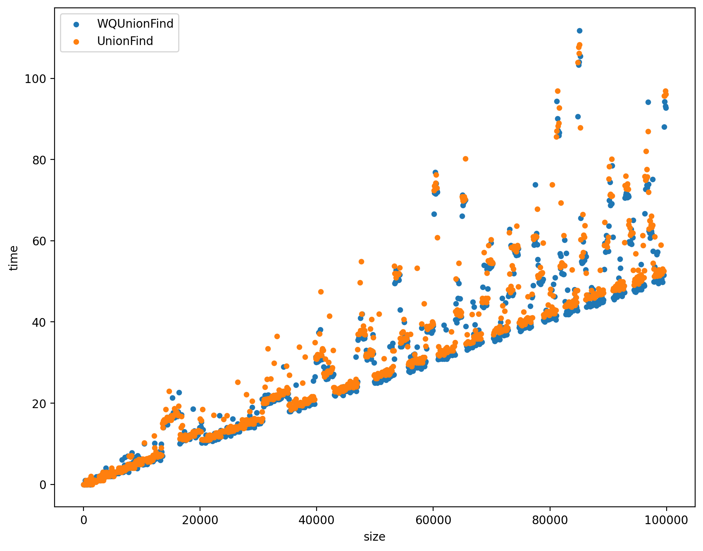
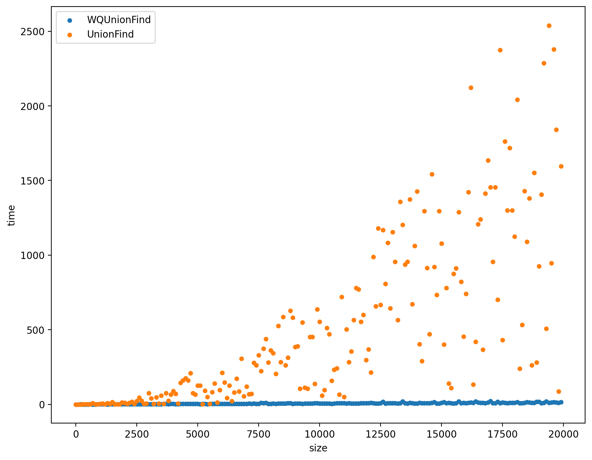

# **华东师范大学数据科学与工程学院上机实践报告**

***

课程名称：算法设计与分析      

上机实验名称：并查集

编号：No.12

年级：21级           

日期：2022年5月22号

***

## 1.实验目的

- 本实验主要设计以下结构：
  - 并查集

## 2. 算法思路

- **并查集**是一种常用的快速结构，最常用于**无向图**，目的是在**最短的时间消耗**内判断一些端点(Vertex)是不是**连通的**
- 并查集有多重优化方式，实验中实现了**按秩合并(weighted)**和**路径压缩(path compression)**两种方法，可以将时间复杂度降至nlog*n，具体的计算和方法书上都有，报告只分析实现的过程
- 至于统计每个集合连通的数量，其实在构造并查集的时候可以一并实现，不需要单独设计算法，下面会展示


## 3.代码分析

首先我们来看一看朴素的并查集的实现

#### 3.1 UnionFind.h

```cpp
#include<vector>
#include<algorithm>
using namespace std;

class UnionFind{
private:
    vector<size_t> _root;// 标记root的位置
    vector<size_t> _size;// 用于计算子树的大小
    size_t number_of_sets;// 存储集合的数量

    // 查找根节点
    size_t findRoot(const size_t& item){
        size_t temp = item - 1;// -1是为了和index的特性一致
        while(temp != _root[temp]){
            temp = _root[temp];// 向上查找，直到根节点（root是自己）
        }    
        return temp;        
    }

public:
    // 构造函数和初始化，由于用的STL，就不需要写析构函数了
    UnionFind(const size_t& size){
        for(size_t i = 0; i < size; i++){
            _root.push_back(i);
            _size.push_back(1);
        }
        number_of_sets = size;
    }

    // 判断是不是连通的
    bool connected(const size_t& lhs, const size_t& rhs){
        return findRoot(lhs) == findRoot(rhs);
    }

    // 外置接口，返回集合数量
    size_t getNumber(){
        return number_of_sets;
    }

    // 外置接口，返回当前集合连通顶点的数量
    size_t getSize(const size_t& index){
        return _size[findRoot(index)];
    }

    // 把两个顶点连通
    void set_union(const size_t& lhs, const size_t& rhs){
        size_t Lroot = findRoot(lhs);
        size_t Rroot = findRoot(rhs);

        if(findRoot(lhs) != findRoot(rhs)) number_of_sets--;// 不在一个集合，集合数量-1
        _root[Lroot] = Rroot;// 树的常规操作
        _size[Rroot] += _size[Lroot];
        
    }
};
```


#### 3.2 WQUnionFind.h

- 实现了两种优化方案，重复的地方不再注释

```cpp
#include<vector>
#include<algorithm>

using namespace std;

class WQUnionFind{
private:
    vector<size_t> _root;
    vector<size_t> _size;
    size_t number_of_sets;

    size_t findRoot(const size_t& item){
        size_t temp = item - 1;
        while(temp != _root[temp]){
            // 路径压缩，向上查找的过程中把每个查找的都指向根节点
            // 类似于树的扁平化操作
            _root[temp] = _root[_root[temp]];
            temp = _root[temp];
        }    
        return temp;        
    }

public:
    WQUnionFind(const size_t& size){
        for(size_t i = 0; i < size; i++){
            _root.push_back(i);
            _size.push_back(1);
        }
        number_of_sets = size;
    }

    //以下是底层数据结构的封装，可以不写
    // size_t getSize(const size_t& index){
    //     return _size[index];
    // }

    // size_t getRoot(const size_t& index){
    //     return _root[index];
    // }

    bool connected(const size_t& lhs, const size_t& rhs){
        return findRoot(lhs) == findRoot(rhs);
    }

    size_t getNumber(){
        return number_of_sets;
    }

    size_t getSize(const size_t& index){
        return _size[findRoot(index)];
    }

    void set_union(const size_t& lhs, const size_t& rhs){
        size_t Lroot = findRoot(lhs);
        size_t Rroot = findRoot(rhs);

        // 按秩合并，小的往大的合并，类似于树的平衡操作
        if(Lroot == Rroot) return;
        if(_size[Lroot] < _size[Rroot]) {
            _root[Lroot] = Rroot;
            _size[Rroot] += _size[Lroot];
        }
        else{
            _root[Rroot] = Lroot;
            _size[Lroot] += _size[Rroot];
        }
        number_of_sets--;
    }
};
```


## 4.算法测试

#### 4.1 时间测试

- 本次实验进行了两种时间测试
  - 一种是全随机化的情况，产生和端点数量一样的随机道路，查找的时候重复n次，查找的两端也是随机的
  - 第二种测试是极端情况，从0到n按顺序连道路，变成一条线，查找也是随机的

- 随机测试，时间的单位是ms



- 极端情况的测试



#### 4.2 结果分析

- 由图可以看出，全随机的情况两种方法的时间消耗差不多，但是极端情况明显进行了两种优化操作的并查集效率更高
- 我们来说说为什么会出现这种情况：

全随机的情况其实出现的树会相对比较平衡，出现极端情况的可能性非常低，所以两种方法不会有明显差距

极端情况的测试当中，朴素的并查集的结构就是有明显不平衡的树，这里已经完全不平衡，整个树只有右分支，所以查找需要的时间消耗就变成了O(n)了，但是平衡(按秩合并)操作的出现就实现了一个**平衡**的过程，降到了O(logn)

- 路径压缩就是在进行查找的时候把查找到的**每一项**都指向**根节点**，如果从树的角度来看，就是实现树的**扁平化**，在查找的时候把所有节点都指向根节点，这样查找的开销降低了，当然这一步操作也是有时间消耗的，具体的计算比较困难，结果就是在O(logn)的基础上更进一步，整体的消耗就减少到了O(log*n)
- 我认为这里减少时间消耗的最主要原因是用**一次查找的消耗**实现了**多次查找的要求**，具体一点来说就是，查找的时候顺便把找的节点，摊开到和自己**平行**的，作为根节点的子节点，下一次查找自己以及根节点的过程，就不需要重复**向上遍历**这一操作了，这样大大减少了查找的时间，当然这里只是简单的分析，实际上严格的证明还是需要数学计算的。

## 5.总结

- 这次的实验过程比较顺利，并查集也是实现起来比较简单的
  
- 时间测试上的测试用例其实还可以用多一点的方法，这次采用了一种极端情况，取得了不错的效果
  
- 并查集为什么需要优化方法，其实也是很值得讨论的，可以看到全随机的情况优化并没有很大的优势，但是实际应用当中，无向图里有一块很大的连通面积，或者说数据出现偏度较大的情况是很容易出现的，全随机的情况其实并不多见，所以优化操作还是很有必要的
  
  
  
## 6.时间测试

#### main.cpp

```cpp
#include "UnionFind.h"
#include "WQUnionFind.h"

#include<iostream>
#include<string>
#include<fstream>

#include<random>
#include<ctime>
#include<chrono>

int __rand(size_t division){
    default_random_engine engine(time(0));
    uniform_int_distribution<int> u(0, INT32_MAX);
    return (u(engine) % division) + 1;
}

void WQUFtest(ofstream& csv, size_t times){
    auto startTime1 = chrono::high_resolution_clock::now();

    WQUnionFind wquf(times);
    for(int i = 0; i < times; i++){
        size_t left = __rand(times);
        size_t right = __rand(times);
        wquf.set_union(left, right); 
    }

    const size_t testConnect = times > 1000 ? 1000 : times;
    for(int i = 0; i < times; i++){
        size_t left = __rand(times);
        size_t right = __rand(times);
        bool result = wquf.connected(left, right);
    }


    auto endTime1 = chrono::high_resolution_clock::now();
    chrono::duration<double, milli> diffTime1 = endTime1 - startTime1;
    csv<<fixed<<diffTime1.count()<<",";
}

void UFtest(ofstream& csv, size_t times){
    auto startTime1 = chrono::high_resolution_clock::now();

    UnionFind uf(times);
    for(int i = 0; i < times; i++){
        // size_t left = __rand(times); // 随机情况
        // size_t right = __rand(times);
        size_t left = i+1; // 极端情况
        size_t right = i+2;
        uf.set_union(left, right); 
    }

    const size_t testConnect = times;
    for(int i = 0; i < times; i++){
        size_t left = __rand(times);
        size_t right = __rand(times);
        bool result = uf.connected(left, right);
    }


    auto endTime1 = chrono::high_resolution_clock::now();
    chrono::duration<double, milli> diffTime1 = endTime1 - startTime1;
    csv<<fixed<<diffTime1.count()<<endl;
}

int main(){
    const size_t testTimes = 20000;
    ofstream csv;
    csv.open("time2.csv", ios::out|ios::trunc);

    csv<<"WQUF"<<","<<"UF"<<endl;

    for(int i = 0; i < testTimes; i+=100){
        cout<<"testing "<<i<<endl;
        WQUFtest(csv, i);
        UFtest(csv, i);
    }

    csv.close();
}
```

